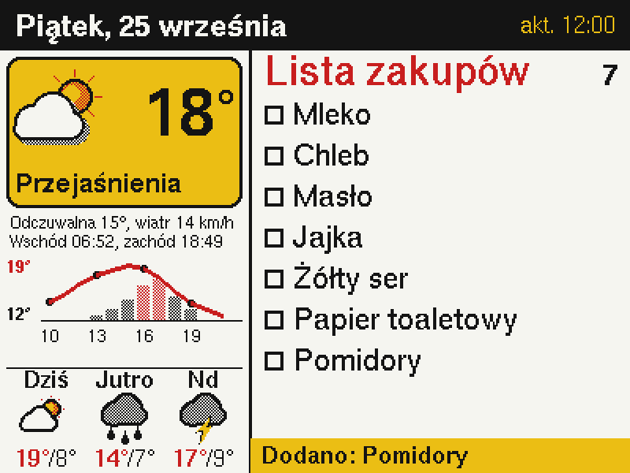
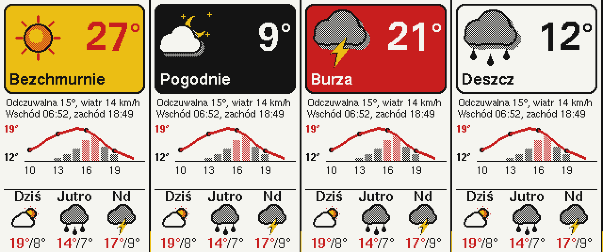

# Lodówka – pogoda i lista zakupów na ZecTrix NOTE4C

Firmware dla **ZecTrix NOTE4C** (ESP32-S3, czterokolorowy e-papier 4,2" 400×300), który zamienia
urządzenie w magnes na lodówkę:

- **pogoda**: bieżąca i na 3 dni, z [Open-Meteo](https://open-meteo.com) (bez klucza API),
- **lista zakupów dodawana głosem**: przytrzymujesz środkowy przycisk i mówisz *„dodaj mleko, chleb i masło”*,
- **panel WWW** w sieci domowej: podgląd i edycja listy z telefonu (np. w sklepie).



*Podgląd wyrenderowany z tego samego kodu UI na PC. Na prawdziwym ekranie kolory są matowe, jak na e-papierze.*

## Jak to działa

```
 [przycisk] ─► mikrofon (ES8311) ─► WAV 16 kHz ─► API rozpoznawania mowy (Whisper)
                                                        │ tekst: "dodaj mleko i chleb"
                                                        ▼
                                  parser poleceń PL ─► lista (pamięć flash) ─► e-papier
```

Rozpoznawanie mowy działa w chmurze, przez dowolne API zgodne z OpenAI `/v1/audio/transcriptions`.
Domyślnie jest to **Groq** (`whisper-large-v3`): ma darmowy limit i dobrze radzi sobie z polskim.
Zamiast niego możesz ustawić OpenAI albo własny serwer Whisper w sieci lokalnej.
Nagranie wysyłane jest tylko wtedy, gdy trzymasz przycisk.

## Obsługa

| Akcja | Co robi |
|---|---|
| **Przytrzymaj środkowy przycisk** i mów od razu, puść po skończeniu | polecenie głosowe (maks. 10 s); zielona dioda świeci, gdy urządzenie nagrywa |
| Przycisk **w górę** | natychmiastowe odświeżenie pogody i ekranu |
| `http://lodowka.local` lub IP ze stopki ekranu | edycja listy z telefonu |

Sygnały dźwiękowe: krótki pisk po puszczeniu przycisku = nagrane, dwa tony w górę = zrobione,
niski ton = nie zrozumiałem albo błąd. Wynik ostatniego polecenia pojawia się na żółtym pasku u dołu ekranu.

### Przykładowe polecenia

| Powiedz | Efekt |
|---|---|
| „Mleko” | dodaje mleko (czasownik nie jest potrzebny) |
| „Mleko, chleb i masło” | dodaje 3 pozycje |
| „Dodaj jajka i żółty ser” | też dodaje |
| „Trzeba kupić ketchup” / „Skończyło się masło” | dodaje |
| „Usuń mleko” / „Skreśl chleb” / „Kupiłem jajka” / „Odhacz masło” | usuwa (rozumie odmianę: „jajek” pasuje do „Jajka”) |
| „Mleko kupione” / „Chleb już mam” / „Masło usuń” | też usuwa (czasownik na końcu) |
| „Nie potrzeba mleka” | usuwa |
| „Cofnij” / „Usuń ostatnie” | usuwa ostatnio dodaną pozycję (gdy coś źle się rozpoznało) |
| „Wyczyść listę” | czyści wszystko |

W polu tekstowym panelu WWW możesz wpisywać te same polecenia.

**Gdy rozpoznawanie się myli:** w panelu WWW otwórz **„Ostatnie nagranie”** (`/nagranie`).
Odsłuchasz tam, co faktycznie nagrał mikrofon, i zobaczysz, jaki tekst z tego rozpoznano.
Do rozpoznawania wysyłana jest podpowiedź z typowymi produktami i bieżącą listą, co mocno pomaga
przy pojedynczych słowach. Jeśli Groq dalej się myli, w `/ustawienia` wybierz **OpenAI**
(model `gpt-4o-mini-transcribe`, płatny, ale lepiej radzi sobie z polskim).

### Pogoda



Kolor karty zależy od pogody: żółta przy słońcu, czarna w nocy, czerwona przy burzy. Temperatura
od 25° jest czerwona. Pod kartą widać wykres na 12 godzin: czerwona linia to temperatura, słupki
to szansa opadów (różowe od 50%). Niżej jest prognoza na 3 dni. Odcienie szarości, pomarańczu
i różu powstają z mieszania kolorów panelu w szachownicę.

> E-papier odświeża się w pełnych kolorach ok. **20–25 s**, a ekran w tym czasie mruga. To normalne.
> Dlatego ekran odświeża się tylko po zmianie listy, zmianie pogody (sprawdzanej co 30 min) i o północy.

## Instalacja z przeglądarki (bez instalowania czegokolwiek)

W katalogu `firmware/` są dwa pliki:

| Plik | Do czego | Ustawienia i lista |
|---|---|---|
| [`lodowka-note4c.bin`](firmware/lodowka-note4c.bin) | **pierwsza instalacja** kablem, od adresu `0x0` | kasuje (to pełny obraz pamięci) |
| [`lodowka-note4c-app.bin`](firmware/lodowka-note4c-app.bin) | **aktualizacje** przez stronę `/aktualizacja` | zachowuje |

Pierwsza instalacja kablem:

1. Podłącz NOTE4C kablem USB-C (kabel musi przesyłać dane, nie tylko ładować) i włącz urządzenie.
2. Otwórz w **Chrome** albo **Edge** stronę <https://espressif.github.io/esptool-js/>
   (Firefox i Safari nie obsługują WebSerial).
3. Ustaw *Baudrate* na `921600` i kliknij **Connect**. Wybierz port urządzenia
   (np. „USB JTAG/serial debug unit”, na Windows `COMx`, na macOS `cu.usbmodem…`).
   - Jeśli port się nie pojawia albo połączenie się nie udaje, wejdź w tryb bootloadera:
     wyłącz urządzenie, przytrzymaj **środkowy przycisk**, włącz je (albo podłącz USB) i puść przycisk.
4. Kliknij **Erase Flash** i poczekaj do końca. To usuwa fabryczne oprogramowanie i stare ustawienia.
5. W sekcji *Program*: *Flash Address* = `0x0`, wybierz plik `lodowka-note4c.bin`, kliknij **Program**.
6. Po komunikacie o zakończeniu kliknij **Disconnect**, odłącz USB i włącz urządzenie ponownie
   (albo wciśnij przycisk zasilania).

> **Uwaga:** krok 4 bezpowrotnie usuwa fabryczny firmware. Fabryczne oprogramowanie i firmware'y
> społeczności są dostępne u producenta ([zectrix.com/en/open-source.html](https://zectrix.com/en/open-source.html)).
> Jeśli masz PlatformIO/esptool, możesz najpierw zrobić pełną kopię:
> `esptool --chip esp32s3 read-flash 0 0x1000000 note4c_backup.bin`.

## Pierwsze uruchomienie – konfiguracja

Przy pierwszym starcie ekran pokaże **„Konfiguracja”**, a urządzenie utworzy własną sieć Wi-Fi.

1. Połącz telefon z siecią **`Lodowka-Setup`** (bez hasła).
2. Strona ustawień zwykle otworzy się sama; jeśli nie, wejdź na `http://192.168.4.1`.
3. Podaj:
   - **sieć Wi-Fi i hasło**: musi być to sieć **2,4 GHz**, bo ESP32 nie obsługuje 5 GHz,
   - **miasto** do prognozy pogody (np. „Kraków”); współrzędne wyszuka się automatycznie,
   - **klucz API** do rozpoznawania mowy. Dla Groq: załóż konto na
     [console.groq.com](https://console.groq.com/keys), wejdź w *API Keys* → *Create API Key*
     i skopiuj klucz (`gsk_...`).
4. Kliknij **Zapisz**. Urządzenie uruchomi się ponownie i po ok. minucie pokaże pogodę i listę.

Ustawienia możesz zmienić później pod `http://lodowka.local/ustawienia` (albo `http://<IP>/ustawienia`;
IP widać na dole ekranu po starcie). Do trybu konfiguracji wejdziesz też, trzymając
**przycisk w górę** podczas włączania. Jeśli zapisana sieć nie odpowiada, urządzenie samo włączy
tryb konfiguracji i dalej będzie próbowało się z nią połączyć.

## Aktualizacje (bez kabla, ustawienia zostają)

1. Pobierz nowy plik `firmware/lodowka-note4c-app.bin`.
2. Na telefonie albo komputerze w tej samej sieci otwórz `http://lodowka.local/aktualizacja`
   (albo `http://<IP>/aktualizacja`).
3. Wybierz plik i kliknij **Wgraj**. Po około minucie urządzenie uruchomi się z nową wersją.

Klucz API, Wi-Fi, miasto i lista zakupów zostają. Strona odrzuci pełny obraz `lodowka-note4c.bin`,
bo wgranie go nadpisałoby ustawienia.

> Jeśli trzeba wgrać coś kablem (np. urządzenie się nie uruchamia), użyj pełnego obrazu
> `lodowka-note4c.bin` od `0x0`. Ustawienia trzeba wtedy podać od nowa.

## Budowanie samodzielnie (PlatformIO)

```bash
pip install platformio
pio run -e note4c -t upload     # kompilacja i wgranie
pio device monitor              # logi (115200)
pio test -e native              # testy parsera poleceń na komputerze
```

Opcjonalnie możesz wpisać ustawienia domyślne na etapie kompilacji:
`cp include/secrets.example.h include/secrets.h`.
Plik ten jest w `.gitignore`. Nie dodawaj go do publicznego pliku `.bin`.

## Zasilanie

Wi-Fi jest cały czas włączone, żeby panel WWW i polecenia głosowe działały od razu. Przy takim
trybie wbudowany akumulator 2000 mAh wystarcza na mniej więcej 1–2 dni, więc na lodówce najlepiej
zasilać urządzenie z ładowarki USB-C (cienki kabel płaski dobrze się sprawdza).

## Struktura

| Plik | Zawartość |
|---|---|
| `src/main.cpp` | pętla główna: przyciski, harmonogram pogody, zadanie odświeżania ekranu |
| `src/epd.*` | sterownik e-papieru SSD2683 (BWRY, 2 bity na piksel) jako `Adafruit_GFX` |
| `src/ui.*` | układ ekranu, ikony pogody, polskie czcionki (U8g2) |
| `src/audio.*` | kodek ES8311: nagrywanie z mikrofonu, sygnały dźwiękowe |
| `src/stt.*` | wysyłka nagrania do API rozpoznawania mowy |
| `src/weather.*` | Open-Meteo i opisy pogody po polsku |
| `src/web.*` | panel WWW i REST API (`/api/list`, `/api/add`, `/api/remove`, `/api/clear`) |
| `src/state.*` | lista zakupów zapisywana w NVS |
| `src/config.*`, `src/settings.*` | ustawienia w NVS, portal konfiguracyjny i strona `/ustawienia` |
| `lib/shopping/` | parser polskich poleceń i logika listy (testowane w `test/`) |
| `include/board.h` | pinout NOTE4C |

Pinout i sekwencję sterowania panelem wzięto z firmware'ów społeczności NOTE4C
([wakewon/NOTE4C-firmware-Rapid](https://github.com/wakewon/NOTE4C-firmware-Rapid),
[alexclmy/Paperwake](https://github.com/alexclmy/Paperwake)). Inicjalizacja ES8311 pochodzi
ze sterownika `esp_codec_dev` od Espressif.

## Rozwiązywanie problemów

- **Pisk błędu od razu po puszczeniu przycisku**: nagranie było za ciche (uznane za ciszę) albo
  kodek nie odpowiada. Zajrzyj do logów w `pio device monitor`.
- **„Nie zrozumiałem: …” na ekranie**: rozpoznany tekst nie pasował do żadnego polecenia. Mów bliżej
  urządzenia, zaczynając od „dodaj” albo „usuń”.
- **„Brak klucza API” na ekranie / `STT HTTP 401` w logach**: popraw klucz w `/ustawienia`.
- **Ekran się nie odświeża / `EPD busy timeout`**: sprawdź, czy masz NOTE4C (czterokolorowy).
  Wersja NOTE4 (czarno-biała) ma inny panel i ten sterownik na niej nie zadziała.
